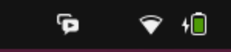
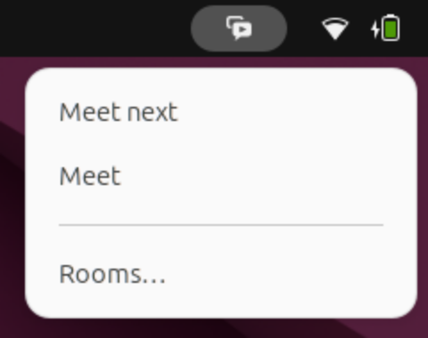
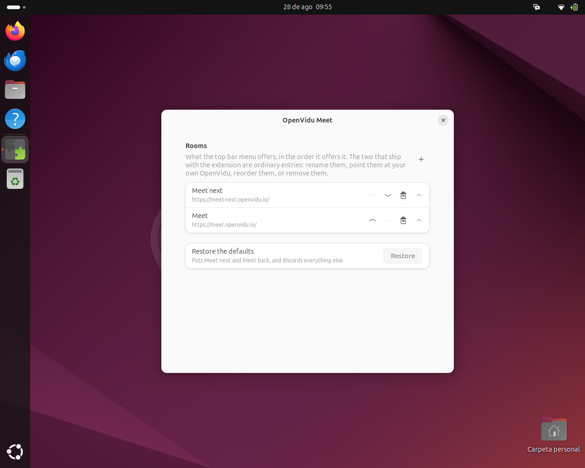

# OpenVidu Meet for GNOME Shell

One click from the top bar into a meeting room.

```sh
curl -fsSL https://raw.githubusercontent.com/gortazar/meet/main/install.sh | sh
```

Then log out and back in, and enable it in the Extensions app.



A button in the top bar whose menu lists your rooms. Click one and it opens in your default
browser. **Meet next** and **Meet** are there from the first launch, and you can rename
them, point them at your own OpenVidu deployment, reorder them or remove them.



## Rooms

Everything the menu offers is a name and an address, edited in the preferences:

```sh
gnome-extensions prefs meet@meet-gs.patxi
```



The two shipped entries are ordinary entries, not special cases — **Restore the defaults**
puts them back if you change your mind. Only `https://` addresses are accepted: this one is
handed straight to whatever your desktop opens web links with, so a `file:` or a
`javascript:` here would not be a broken link but the extension opening something on your
behalf that you did not mean.

## What it does not do

- **It does not force a new window.** The URL goes to your default handler, and a browser
  that is already running normally opens a tab. Guaranteeing a window means knowing which
  browser it is and passing its own flag, which is browser-specific, breaks under Flatpak,
  and needs a subprocess this extension otherwise does not have.
- **It does not reach the network, ever.** The panel icon is an original symbolic drawing
  shipped with the extension, not a logo fetched at runtime, so it works offline and there
  is nothing to fetch.
- **It does not spawn anything.** No `xdg-open`, no `GLib.spawn`, no `Gio.Subprocess`.

OpenVidu and OpenVidu Meet are trademarks of their owners. This is an independent launcher
and ships none of their artwork.

## Development

```sh
nix develop              # gjs, eslint, glib, and everything the suite needs
gjs -m tests/run.js      # the headless suite — 112 tests, no compositor needed
nix flake check          # lint + suite + the packed zip assembled and inspected
nix build                # the packed .shell-extension.zip
```

Everything with a decision in it lives under `src/lib/` and imports only GLib and Gio, so it
runs under plain `gjs`. `src/extension.js` and `src/prefs.js` are the only files that touch
the compositor or GTK, and they are thin.

### The nested shell

```sh
ci/smoke-test.sh                     # boot a headless GNOME Shell and drive the extension
ci/smoke-test.sh --shots screenshots # ... and write the images above
gjs -m ci/crop.js screenshots        # trim them to the part worth looking at
```

This answers what the headless suite cannot: that the icon is actually *drawn* rather than
the blank GNOME silently substitutes for one it cannot rasterise, that clicking a room
really reaches the desktop's default handler for `https` — a stub browser is registered and
records what it was asked to open — and that five enable/disable rounds leave nothing
attached to the main loop.

It runs against a throwaway `HOME` of its own. That is not a nicety: it registers a stub
program as the default browser, and outside that isolation it would do so to the session you
are sitting in.

## Licence

GPL-2.0-or-later, the licence GNOME Shell extensions are expected to carry. See
[`src/LICENSE`](src/LICENSE).
