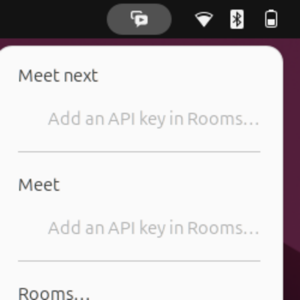
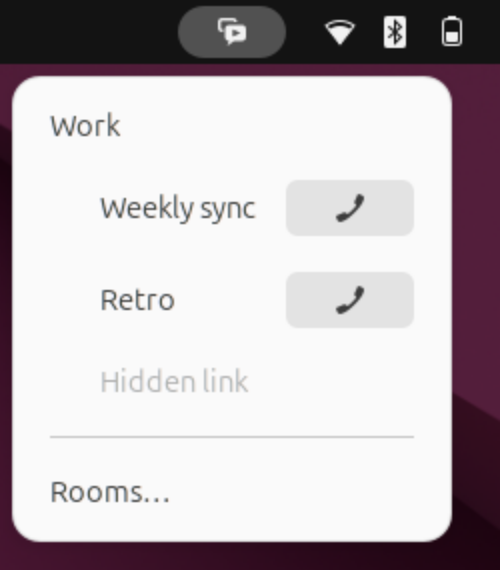
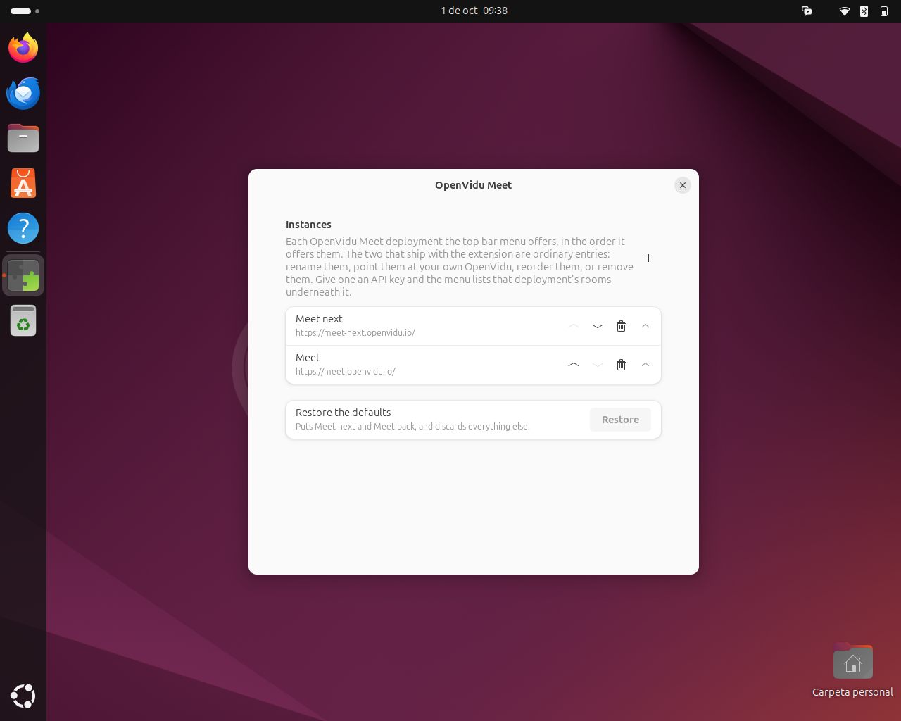

# OpenVidu Meet for GNOME Shell

One click from the top bar into a meeting room.

```sh
curl -fsSL https://raw.githubusercontent.com/gortazar/meet/main/install.sh | sh
```

Then log out and back in, and enable it in the Extensions app.


A button in the top bar whose menu lists your OpenVidu Meet **instances**. Click one and it
opens in your default browser. **Meet next** and **Meet** are there from the first launch,
and you can rename them, point them at your own OpenVidu deployment, reorder them or remove
them.



## Rooms

Give an instance an API key and the menu lists that deployment's **rooms** underneath it,
each with a button that opens the call — not the room's page.



The button opens the room's anonymous **moderator** link, exactly as the instance supplies
it. The link's `secret` is what puts you in the meeting with that role, so the extension
never builds one and never strips one: a room whose link it cannot vouch for — not
`https:`, not on that instance's own host, or missing the `secret` — is listed with no
button rather than with a button that quietly goes somewhere else.

The newest twenty rooms are shown, closed ones included, with a **…and N more** row when
there are others.

## Instances, and their API keys

Everything the menu offers is a name, an address and an optional API key, edited in the
preferences:

```sh
gnome-extensions prefs meet@meet-gs.patxi
```



Expand an instance to reach its **API key** field. The key is generated on that deployment's
*Embedded* page, and it is what lets the extension ask for the room list. An instance
without one is not an error — it is an instance whose rooms are not known, and its own row
goes on working. **The two shipped instances are OpenVidu's own demos, not your deployment,
so they will show *Add an API key* unless you have a key for them.**

The key is kept in your **login keyring**, through libsecret, and never in dconf — a
setting is readable by anything in your session and turns up in a `dconf dump` you might
paste into a bug report.

The two shipped entries are ordinary entries, not special cases — **Restore the defaults**
puts them back if you change your mind. Only `https://` addresses are accepted: this one is
handed straight to whatever your desktop opens web links with, so a `file:` or a
`javascript:` here would not be a broken link but the extension opening something on your
behalf that you did not mean. It is also where an API key would be sent, which is a second
reason not to allow `http:`.

## What it sends, and where

One request, to one place, and only when you ask for it:

- **When**: when you open the menu. Never on a timer, and never while the menu is closed.
- **Where**: `GET <your instance>/api/v1/rooms?maxItems=100`, over HTTPS, to the instance
  you configured and to nowhere else.
- **What**: your API key for that instance, in the `X-API-KEY` header the OpenVidu Meet REST
  API documents. Nothing else — no identifier of you, your machine or your session.
- **How long**: ten seconds, then it gives up and the menu says so. Closing the menu or
  disabling the extension cancels whatever is in flight.

The room names and join links that come back are held in memory for the session and are
never written to disk. No analytics, no telemetry, no third party.

## What it does not do

- **It does not force a new window.** The URL goes to your default handler, and a browser
  that is already running normally opens a tab. Guaranteeing a window means knowing which
  browser it is and passing its own flag, which is browser-specific, breaks under Flatpak,
  and needs a subprocess this extension otherwise does not have.
- **It does not reach the network except to list your rooms**, as described above, and
  only to the instances you configured. The panel icon is an original symbolic drawing
  shipped with the extension, not a logo fetched at runtime, so the button itself works
  offline and there is nothing to fetch. An instance with no API key is never contacted at
  all.
- **It does not put a join link anywhere it could be read.** The link's secret is a
  credential; it is never logged and never shown, and a failure message that quotes it —
  which is how your browser reports an error — is redacted before it reaches the screen.
- **It does not spawn anything.** No `xdg-open`, no `GLib.spawn`, no `Gio.Subprocess`.

OpenVidu and OpenVidu Meet are trademarks of their owners. This is an independent launcher
and ships none of their artwork.

## Development

```sh
nix develop              # gjs, eslint, glib, and everything the suite needs
gjs -m tests/run.js      # the headless suite — 298 tests, no compositor needed
nix flake check          # lint + suite + the packed zip assembled and inspected
nix build                # the packed .shell-extension.zip
```

Everything with a decision in it lives under `src/lib/` and imports only GLib and Gio, so it
runs under plain `gjs`. `src/extension.js` and `src/prefs.js` are the only files that touch
the compositor or GTK, and they are thin.

### The nested shell

```sh
ci/smoke-test.sh                     # boot a headless GNOME Shell and drive the extension
ci/smoke-test.sh --shots screenshots # ... and write the images above
gjs -m ci/crop.js screenshots        # trim them to the part worth looking at

# and, for a release: run the published artefact rather than the checkout
MEET_INSTALL_ZIP=meet@meet-gs.patxi.shell-extension.zip ci/smoke-test.sh
```

This answers what the headless suite cannot: that the icon is actually *drawn* rather than
the blank GNOME silently substitutes for one it cannot rasterise, that clicking a room
really reaches the desktop's default handler for `https` — a stub browser is registered and
records what it was asked to open — and that five enable/disable rounds leave nothing
attached to the main loop.

`MEET_INSTALL_ZIP` is what makes this a check of a *release* rather than of a working tree:
it unpacks the published zip into the nested shell instead of copying `src/`, so a file left
out of the package fails here. Everything else in the script reads the checkout, where the
missing file is still present.

It runs against a throwaway `HOME` of its own. That is not a nicety: it registers a stub
program as the default browser, and outside that isolation it would do so to the session you
are sitting in.

## Licence

GPL-2.0-or-later, the licence GNOME Shell extensions are expected to carry. See
[`src/LICENSE`](src/LICENSE).
